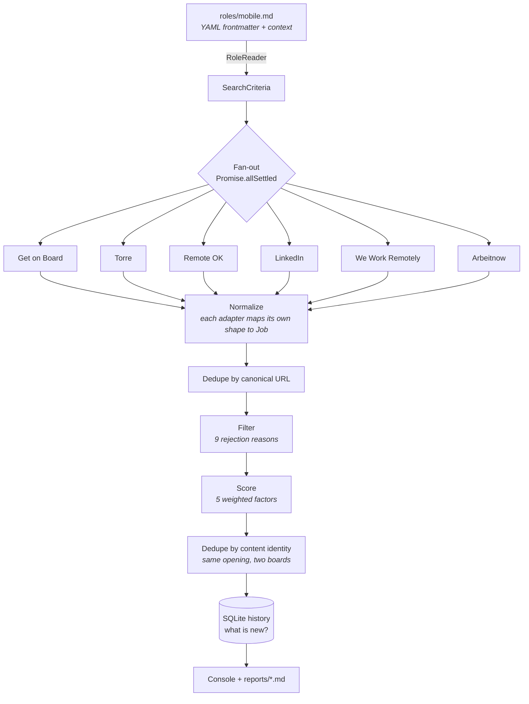
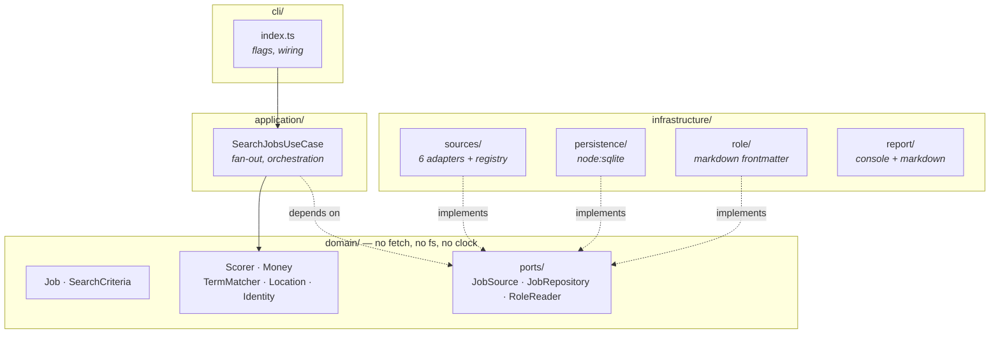
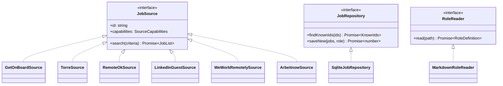
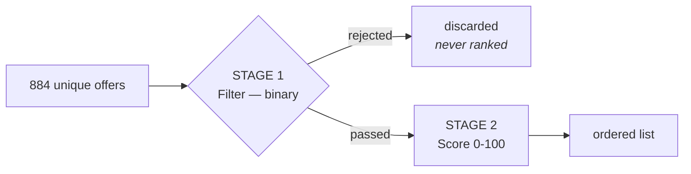
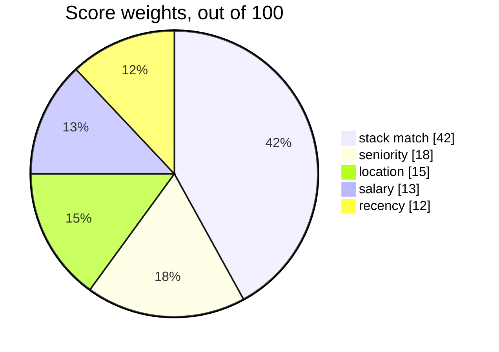
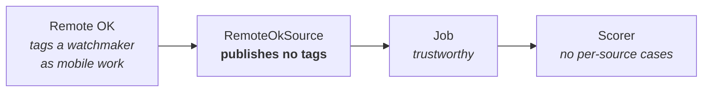

# How searchJob works

A job search aggregator for one role at a time. It queries six boards in
parallel, normalizes every offer into a single shape, deduplicates twice,
filters against hard rules, and ranks what survives by fit.

Every design decision below came out of a measured failure on live data. None of
it is theoretical.

---

## 1. The problem

Searching by hand means opening six sites, typing the same query fourteen times,
and rereading the two hundred offers you already saw yesterday. Within a week
you stop.

One run answers instead: **1300 raw offers, deduplicated against your history,
ranked by fit, in under thirty seconds** — and it tells you which ones are new
since the last time you looked.

---

## 2. A run, end to end



A single source failing never sinks the run: `Promise.allSettled` collects what
worked and the report names what did not.

---

## 3. Architecture

Hexagonal, governed by one rule.



**Every arrow points inward.** `domain/` imports nothing from
`infrastructure/`. Verifiable in one command:

```bash
rg "@infra|@app" src/domain/     # no matches
rg "fetch|node:fs|new Date\(\)" src/domain/ --glob '!**/__tests__/**'   # no matches
```

### What that buys

**Rules are tested without a network.** 130 tests run in under a second: no HTTP
mocks, no fake server, no fixture rigs. Pass the scorer a plain object, assert a
number. The watchmaker bug below took three lines to pin down.

**Adding a board is one file and one line.** Each implements `JobSource` and
registers itself. Whether it is a clean REST API or an HTML scrape is the
adapter's problem, never the ranking's.

**Storage is deferred.** SQLite today because `node:sqlite` ships with Node 22
and needs no dependency. Swapping it means implementing `JobRepository`.

### The three ports



`capabilities` records what a source can do natively — server-side query,
seniority filter, salary data, authentication. It says how much work the domain
can skip, **never whether a result can be trusted**: asking Remote OK for
`?tags=android` returned "Short Form Video Content Creator".

---

## 4. Filtering and scoring are two passes

Confusing them is the most common way to get this wrong.



**Stage 1 — filter.** An offer passes or disappears. Nine reasons:

`excluded-title` · `off-target` · `excluded-stack` · `not-remote` · `too-old` ·
`date-unknown` · `location-mismatch` · `salary-unknown` · `below-salary-floor`

**Stage 2 — score.** Only for survivors, and it decides order, never inclusion.



### Why salary carries only 13 points

Most boards publish none. Weight it heavily and the ranking belongs to whichever
source exposes numbers — measured: sorting by salary gave Torre 87 of 103 slots
and buried a Mozilla staff iOS role that published none.

An unpublished salary scores **7.15 of 13**: above the floor, below a good
offer. Neither rewarded nor punished.

| Salary | Points | |
|--------|-------:|-|
| USD 1,000/mo | 3.25 | `###` |
| USD 2,000/mo | 4.64 | `#####` |
| USD 3,000/mo | 6.04 | `######` |
| USD 4,000/mo | 7.43 | `#######` |
| USD 6,000/mo | 10.21 | `##########` |
| USD 8,000/mo | 13.00 | `#############` |
| USD 12,000/mo | 13.00 | `#############` |
| _unpublished_ | 7.15 | `#######` |

The curve saturates at the target, not at some multiple of the floor.

The floor filters and the target calibrates. They are separate numbers on
purpose: deriving one from the other meant that widening coverage by lowering
the floor silently flattened the top of the ranking.

---

## 5. The domain, module by module

Not one of these exists for elegance. Each one is a bug that reached production
data.

| Module | Responsibility | The failure that created it |
|--------|---------------|------------------------------|
| `TermMatcher` | token-boundary matching | `ios` matched the Spanish words nego**cios**, servi**cios**, inventa**rios** |
| `Money` | normalize to USD/month, sanity bounds | 5,900,000 COP outranked USD 120,000/year |
| `Location` | geographic eligibility | Townsville, Brisbane, Cairns and Chennai ranked as reachable from Peru |
| `Identity` | same opening across boards | one BairesDev role appeared twice, from Torre and LinkedIn |
| `Job` | `gateText` vs `searchableText` | a **Seiko watchmaker** scored 63, because "swift" means fast |
| `Scorer` | filter, then rank | ranking by salary handed the list to one source |

### Three rules worth internalizing

**Unknown is neither good nor bad.** An unpublished salary and an unstated
location both score around 0.55 of their weight. *Absence of evidence is not
evidence of absence.* Punish the unknown and you bury the best offers, which are
often the ones that publish least.

**The gate and the score read different text.** Deciding whether an offer is
even in your field uses **title and tags only** (`gateText`). The free-text body
only contributes points (`searchableText`). In English, *swift*, *combine*,
*rest* and *flutter* are ordinary words.

**Regions and countries are not the same thing.** "latam" covers Peru by
definition; "Colombia" does not. `require_country` depends entirely on that
distinction.

---

## 6. Dirty data is cleaned at the edge



Remote OK sprays category tags that do not describe the role. **180 of its 186
"relevant" results passed the domain gate on tags alone** — watchmakers, valets,
greenkeepers, a surveyor.

The tempting fix was `if (source === 'remoteok')` inside the scorer. That is how
a domain rots: one conditional per source, and by the sixth nobody understands
the ranking any more.

The real fix was one line in the adapter. **The adapter owes the domain honest
data.** The domain receives `Job` and trusts it.

This is what hexagonal architecture actually buys — not the `domain/` folder,
which anyone can copy, but a clear answer to *who carries the mess* so the
business rules stay clean and testable.

---

## 7. Adding a source

```ts
export class MyBoardSource implements JobSource {
  readonly id = 'myboard'
  readonly capabilities = {
    serverSideQuery: true,
    seniorityFilter: false,
    salaryData: false,
    requiresAuth: false,
  }

  async search(criteria: SearchCriteria): Promise<Job[]> {
    // translate SearchCriteria into this board's dialect,
    // map its response into Job, and publish only what you trust
  }
}
```

Then one line in `sources/registry.ts`. Nothing in `domain/` changes.

For a board that needs a login, a `SessionProvider` holds a persisted Playwright
`storageState` and the adapter still implements the same port. LinkedIn did not
need it: its public guest endpoint answers without an account.

---

## 8. Where things live

```
roles/                      one file per search profile, gitignored except the template
src/
  domain/                   zero dependencies
    Job.ts                  the entity; gateText vs searchableText
    SearchCriteria.ts       what a role file becomes
    TermMatcher.ts          token-boundary matching
    Money.ts                currency and periodicity normalization
    Location.ts             geographic eligibility
    Identity.ts             content identity across boards
    Scorer.ts               filter, then rank
    ports/                  JobSource · JobRepository · RoleReader
  application/
    SearchJobsUseCase.ts    fan-out, dedupe, history
  infrastructure/
    sources/                6 adapters + registry
    persistence/            node:sqlite
    role/                   markdown frontmatter parser
    report/                 console + markdown
  cli/
data/jobs.db                history: what you have already seen
reports/                    generated, one per run
```

---

## 9. Numbers from a real run

```
1316 raw  →  1057 unique URLs  →  17 relevant  ·  2 cross-board copies merged
Get on Board 160 · Torre 285 · Remote OK 246 · LinkedIn 150 · WWR 25 · Arbeitnow 450
```

Filters compound hard. Three stacked constraints — mobile only, Peru-inclusive
LATAM, published within three days — take 1316 offers down to 17. Widening the
window to seven days is usually the difference between a list you read and a
list you ignore.
